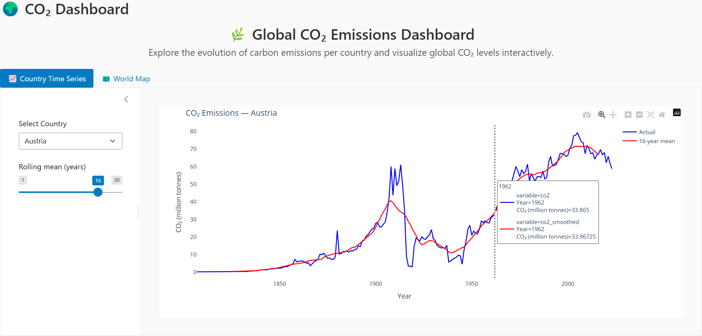
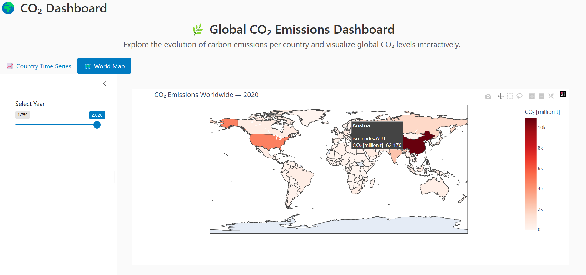

# 🌍 CO₂ Dashboard — mini Student Project

**Author:** Kimia Nili  
**Stack:** Shiny for Python, Plotly, Pandas, Docker

A small dashboard that explores CO₂ emissions (Our World in Data).  
This project was built as a hands-on learning exercise — it is not production-ready,
but it demonstrates basic ETL, interactive visualization, and simple containerization.

---

## 🖼️ Dashboard Preview





---

## ⚙️ Quickstart (local)

# Clone the repository

```bash
git clone https://github.com/kimianili00/co2-dashboard.git

cd co2-dashboard

# Create & activate a virtual environment (optional but recommended):

python -m venv .venv

# Windows
.venv\Scripts\activate

# mac / linux
source .venv/bin/activate

# Install dependencies
pip install -r requirements.txt

# Run the app
shiny run --host 0.0.0.0 --port 8000 app.py

```

Open 👉  [http://localhost:8000](http://localhost:8000) in your browser .
---

## 🐳 Quickstart (Docker):
```bash
docker build -t co2-dashboard .

docker run -p 8000:8000 co2-dashboard
```

---


## 📊 What it does:

-Downloads CO₂ dataset from *Our World in Data *.

-Cleans and validates columns used in the dashboard.

-shows:

  -📈Country-level time series (with optional rolling mean).

  -🗺️ World choropleth map per selected year.

---

##🧠 Project Structure

```bash
co2-dashboard/
│
├── app.py
├── data.py
├── utils.py
├── viz.py
├── __init__.py
├── requirements.txt
├── README.md
├── Dockerfile
├── .dockerignore
├── .gitignore
│
├── tests/
│   └── test_data.py
│
├── assets/
│   ├── screenshot1.png
│   └── screenshot2.png
│
└── .github/
    └── workflows/
        └── ci.yml


```
---

## 💡 What I learned :

-How to clean and validate real-world CSV files (missing and malformed rows).

-How to use Plotly to build interactive charts and export them as HTML.

-Basics of Shiny for Python reactivity and layout.

-Dockerizing a small Python app and thinking a bit about image size and caching.


*At first my Docker build failed because I forgot to copy the data file — that helped me learn about Docker context.*

---

## ⚠️ Limitations & Known Issues (be honest):

- Data is downloaded at app start (not ideal for production). If the OWID URL is down,

  the app will fail to start — I left prints so you can see what happened in logs.

- I kept the print() logs intentionally for debugging while learning.

- Very little error UI for the user — currently the app shows simple messages.

- Not optimized for very large datasets (>1M rows). For production we'd use PySpark/Databricks.

- Tests are basic and hit the network; in CI you'd want fixtures / saved small CSVs.

---

##🗒️ Design notes:

I intentionally kept some print() statements for debugging and demonstration purposes.

TODOs are left in code to show future work ideas (better caching strategy, background loading, CI).

I had some trouble with Docker port mapping at first — I learned to use explicit host/port flags.

---

## 🧪 Tests:


Run tests with:
```bash
pytest

```
---

## ✍️ Notes: 

- I initially tried matplotlib but switched to Plotly for easier interactivity.

- This project taught me that small things like caching, data cleaning, and reactive UI updates matter even in simple dashboards.

- Tests are simple and meant to show you understand automated testing basics.

---

## 🌱 Future improvement:

-Add background data loading + graceful error page.

-Add a small PySpark notebook to demonstrate how this pipeline could scale on Databricks.

-Add more tests (edge cases for sparse countries, interpolation behavior).

---

## 📬 Contact
📧 Kimianili00@gmail.com
🔗  [Linkedin](https://www.linkedin.com/in/kimia-nili-826b0038b/)

---

